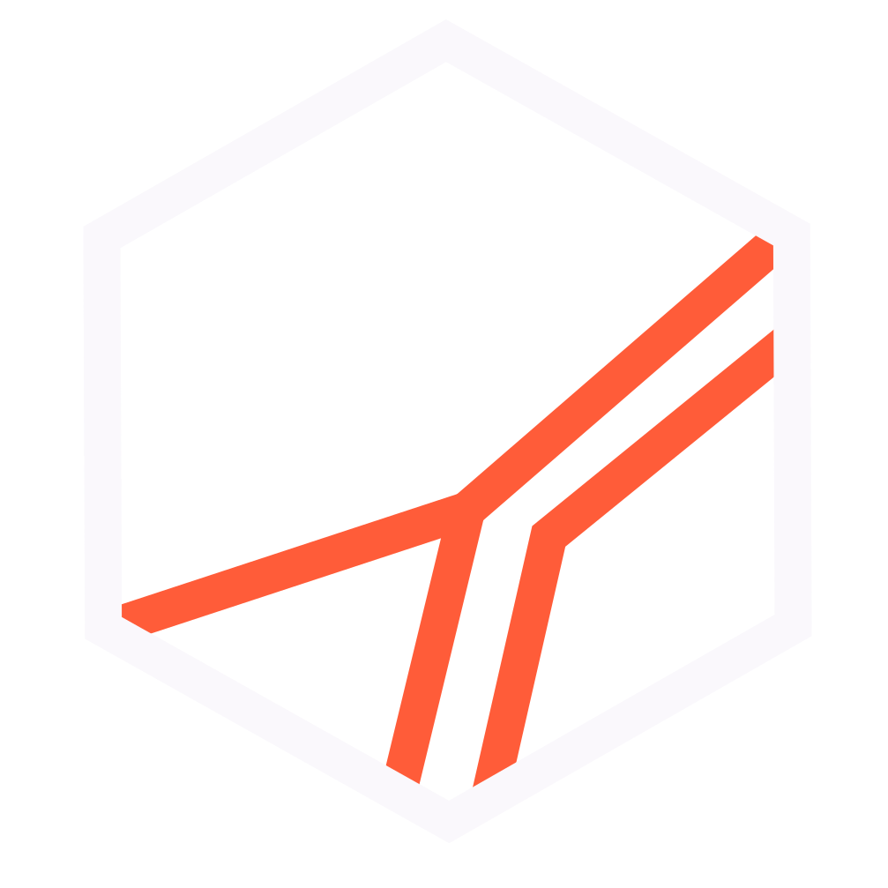

# Diego Maury — Design System V2

**Sistema "Ember on Ink"**  
*"Hagamos que las cosas pasen."*

Sistema de diseño personal de Diego Maury: Strategic Program Director operando en LATAM. Sirve cualquier superficie — web, documento, deck, redes — con identidad consistente.

> **v2.0 — Ember on Ink.** Sistema completamente renovado. Dark-first, acento único Electric Ember, Plus Jakarta Sans + DM Mono. Sin gradientes, sin glows, sin efectos. Todo autocontenido.

---

## Esencia de marca

| Atributo | Definición |
|---|---|
| **Nombre** | Diego Maury |
| **Título** | Strategic Program Director |
| **Tagline (1ª persona)** | Hago que las cosas pasen. |
| **Tagline (invitación)** | Hagamos que las cosas pasen. |
| **URL** | diegomaury.mx |
| **Substack** | diegomaury.substack.com · Haz que Pase |
| **Métricas clave** | 30+ programas · 900+ proyectos · 3,000+ emprendedores |

---

## Paleta — Ember on Ink

| Token | Hex | Nombre | Uso |
|---|---|---|---|
| `--color-bg-primary` | `#0A0612` | Deep Ink | Fondo principal |
| `--color-bg-secondary` | `#1A1128` | Surface | Cards, paneles, hover |
| `--color-border` | `#2A1F3D` | Border | Bordes y separadores |
| `--color-text-primary` | `#FAF8FC` | Off White | Headlines, nombre |
| `--color-text-secondary` | `#9A8CB0` | Lavender | Role, URL, metadata |
| `--color-text-tertiary` | `#8B7C9E` | Muted | Supporting copy |
| `--color-accent` | `#FF5C39` | Electric Ember | Acento único |

**Regla crítica:** Ember (`#FF5C39`) aparece **exactamente una vez por pieza**, en el elemento más importante. Nunca dos colores vivos simultáneos. Sin gradientes, drop shadows, blur ni glow.

---

## Tipografía

```html
<!-- Google Fonts — cargar en el <head> -->
<link href="https://fonts.googleapis.com/css2?family=Plus+Jakarta+Sans:ital,wght@0,300;0,400;0,500;0,700;1,400;1,700&family=DM+Mono:wght@400;500&display=swap" rel="stylesheet">
```

| Familia | Rol | Pesos |
|---|---|---|
| **Plus Jakarta Sans** | Titulares · UI · Cuerpo | 300 · 400 · 500 · 700 · Itálica |
| **DM Mono** | Cifras · Fechas · Labels · Tagline | 400 · 500 |

**DM Mono siempre:** uppercase, letter-spacing 0.06–0.18em. Nunca para párrafos largos.

---

## Tokens CSS

Importar `v2-tokens.css` o usar las variables directamente:

```css
:root {
  --bg: #0A0612;  --bg-2: #1A1128;  --border: #2A1F3D;
  --t1: #FAF8FC;  --t2: #9A8CB0;   --t3: #8B7C9E;
  --ember: #FF5C39;
  --sans: 'Plus Jakarta Sans', system-ui, sans-serif;
  --mono: 'DM Mono', ui-monospace, monospace;
}
```

---

## Assets de marca

### SVG isotipo (fuente de verdad)

| Archivo | Descripción |
|---|---|
| `assets/isotipo-final-ember.svg` | Hexágono Off-White + facetas Ember — sin fondo |
| `assets/isotipo-final-white.svg` | Todo en blanco (una tinta) |
| `assets/isotipo-final-circulo.svg` | Contenedor circular · fondo Deep Ink |
| `assets/isotipo-final-cuadrado.svg` | Contenedor cuadrado · fondo Deep Ink |

El isotipo nunca se deforma, rota ni se le agregan efectos. Solo se usan estas 4 variantes.

### Lockup base (código)

```html
<!-- Lockup isotipo + nombre -->
<div style="display:flex;align-items:center;gap:14px;">
  
  <div style="width:1px;height:28px;background:#2A1F3D;"></div>
  <div>
    <div style="font-weight:700;text-transform:uppercase;color:#FAF8FC;">Diego Maury</div>
    <div style="font-family:'DM Mono';font-size:10px;color:#9A8CB0;letter-spacing:.04em;">Strategic Program Director</div>
  </div>
</div>
```

---

## Archivos del sistema

### Documentación y especificaciones

| Archivo | Descripción |
|---|---|
| `manual-de-marca.html` | Manual completo 8 secciones — v2.0 |
| `logo-specs.html` | Especificaciones técnicas del isotipo |
| `Sistema Tipográfico.html` | Specimen tipográfico completo — v2.0 |

### Assets de marca (v2.0)

| Archivo | Formato | Estado |
|---|---|---|
| `Firma de Correo.html` | Tabla HTML · Gmail/Outlook | ✅ v2.0 |
| `Tarjeta de Presentación.html` | 480×310 · frente + reverso | ✅ v2.0 |
| `Portada LinkedIn.html` | 1584×396 · 2 variantes | ✅ v2.0 |
| `Portada Facebook.html` | 851×315 · 3 variantes | ✅ v2.0 |
| `Firma Substack.html` | 1344×256 banner | ✅ v2.0 |
| `Substack Banners.html` | 1080×1080 · quotes carousel | ✅ v2.0 |
| `Quote Cards.html` | 1080×1080 · 10 quotes | ✅ v2.0 |
| `Social Banners.html` | Multi-formato · LinkedIn/Twitter/FB/Square | ✅ v2.0 |
| `Footer.html` | Web footer · oscuro y claro | ✅ v2.0 |
| `Fondo Perfil.html` | 800×800 · fondo único | ✅ v2.0 |
| `Fondos Perfil.html` | 800×800 · 4 variantes | ✅ v2.0 |
| `Foto de Perfil.html` | 800×800 · isotipo + headshot | ✅ v2.0 |
| `poster.html` | 1080×1080 · poster editorial | ✅ v2.0 |
| `Logo Animation.html` | 1920×1080 · CSS animation | ⏳ pendiente |

### Preview cards (design system)

| Archivo | Descripción |
|---|---|
| `preview/v2-colors.html` | Paleta completa v2.0 |
| `preview/v2-typography.html` | Escala tipográfica |
| `preview/v2-logo.html` | Variantes del isotipo |
| `preview/v2-components.html` | Componentes base |
| `preview/v2-surfaces.html` | Superficies y bordes |
| `preview/v2-spacing.html` | Espaciado y radii |

---

## Reglas de diseño no negociables

1. **Un solo acento:** Ember `#FF5C39` — exactamente una vez por pieza, en el elemento más importante.
2. **Sin efectos:** Prohibidos gradientes, drop shadows, blur, glow, efectos decorativos.
3. **Dark mode primario:** Fondo `#0A0612` por defecto.
4. **DM Mono restringido:** Solo para cifras, fechas, labels, tagline. Nunca párrafos.
5. **Morado como estructura:** `#1A1128` y `#2A1F3D` son fondos y bordes, nunca acento.
6. **Espacio generoso:** Ante la duda, más espacio.
7. **Autocontenido:** Sin dependencias externas salvo Google Fonts. Sin `colors_and_type.css`.

---

*Diego Maury Design System V2 · Ember on Ink · 2025*
