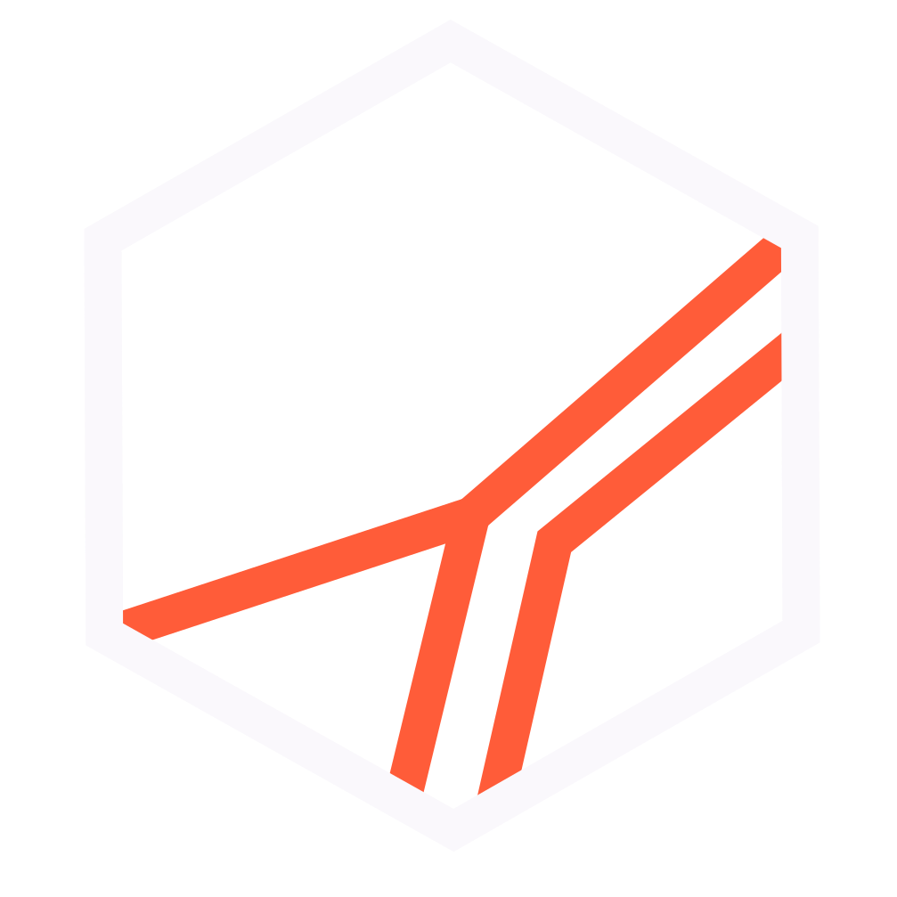

# Diego Maury — Design Skill (V2 · Ember on Ink)

Lee el `README.md` y explora los demás archivos disponibles. Puntos de entrada:

- `README.md` — contexto completo de marca, fundamentos visuales, reglas de uso.
- `styles.css` — entry point canónico (importa `v2-tokens.css`). **Linkear este archivo** en proyectos nuevos.
- `v2-tokens.css` — fuente de verdad de tokens CSS: colores + tipografía (contrato reducido P4b). **Nunca** `colors_and_type.css` ni `dm-brand.css` (eliminados).
- `assets/` — isotipos oficiales: `isotipo-dark.svg` (fondos oscuros), `isotipo-light.svg` (fondos claros), `isotipo-final-ember.svg` (sin fondo), `isotipo-final-white.svg`, `isotipo-final-circulo.svg`, `isotipo-final-cuadrado.svg`.
- `preview/` — cards de design system: colores, tipografía, logo, componentes, superficies, espaciado.
- `ui_kits/portfolio/` — recreación React del portafolio `diegomaury.mx`.

## Cuando se invoca

Si se crean artefactos visuales (slides, mocks, prototipos, assets de redes), copiar assets necesarios y crear archivos HTML estáticos. Si es código de producción, leer `README.md` completo y aplicar todas las reglas del sistema.

Si se invoca sin instrucciones específicas, preguntar al usuario qué quiere construir, audiencia, superficie y formato, y actuar como diseñador experto que entrega HTML o código de producción.

## Sistema — Ember on Ink

> Dark-first. Acento único. Sin efectos. Todo autocontenido.

### Paleta

| Token | Hex | Nombre | Uso |
|---|---|---|---|
| `--bg` / `--color-bg-primary` | `#0A0612` | Deep Ink | Fondo principal |
| `--bg-2` / `--color-bg-secondary` | `#1A1128` | Surface | Cards, paneles, hover |
| `--border` / `--color-border` | `#6A291B` | Ember Dark | Bordes y separadores |
| `--t1` / `--color-text-primary` | `#FAF8FC` | Off White | Headlines, nombre |
| `--t2` / `--color-text-secondary` | `#DDDBE0` | Near White | Role, URL, metadata |
| `--t3` / `--color-text-tertiary` | `#A8A6AC` | Neutral Mid | Supporting copy |
| `--ember` / `--color-accent` | `#FF5C39` | Electric Ember | **Acento único** |

**Regla crítica:** Ember (`#FF5C39`) aparece **exactamente una vez por pieza**, en el elemento más importante. Nunca dos colores vivos simultáneos.

### Tipografía

```html
<!-- Google Fonts — cargar en el <head> -->
<link href="https://fonts.googleapis.com/css2?family=Plus+Jakarta+Sans:ital,wght@0,300;0,400;0,500;0,700;1,400;1,700&family=DM+Mono:wght@400;500&display=swap" rel="stylesheet">
```

| Familia | Rol | Pesos |
|---|---|---|
| **Plus Jakarta Sans** | Titulares · UI · Cuerpo | 300 · 400 · 500 · 700 · Itálica |
| **DM Mono** | Cifras · Fechas · Labels · Tagline | 400 · 500 |

**DM Mono siempre:** uppercase, letter-spacing 0.06–0.18em. Nunca para párrafos largos.

### Taglines

- **Invitación:** `"HAGAMOS QUE LAS COSAS PASEN."` → DM Mono, uppercase, letter-spacing 0.18em, color Ember
- **Primera persona:** `"Hago que las cosas pasen."` → DM Mono itálica, color `#DDDBE0`

### Lockup base

```html
<div style="display:flex;align-items:center;gap:14px;">
  
  <div style="width:1px;height:28px;background:#6A291B;"></div>
  <div>
    <div style="font-family:'Plus Jakarta Sans',sans-serif;font-weight:700;text-transform:uppercase;color:#FAF8FC;font-size:15px;letter-spacing:.005em;">Diego Maury</div>
    <div style="font-family:'DM Mono',monospace;font-size:10px;color:#DDDBE0;letter-spacing:.04em;margin-top:3px;">Strategic Program Director</div>
  </div>
</div>
```

## Esencia de marca

| Atributo | Valor |
|---|---|
| **Nombre** | Diego Maury |
| **Título** | Strategic Program Director |
| **Tagline** | Hagamos que las cosas pasen. |
| **URL** | diegomaury.mx |
| **Substack** | diegomaury.substack.com · Haz que Pase |
| **Métricas** | 30+ programas · 900+ proyectos · 3,000+ emprendedores |

## Reglas no negociables

1. **Un solo acento:** Ember `#FF5C39` — exactamente una vez por pieza.
2. **Sin efectos:** Prohibidos gradientes, drop shadows, blur, glow, efectos decorativos.
3. **Dark mode primario:** Fondo `#0A0612` por defecto.
4. **DM Mono restringido:** Solo cifras, fechas, labels, tagline. Nunca párrafos.
5. **Estructura en tinta + ember:** El violeta queda solo en los fondos (`#0A0612`, `#1A1128`); texto de apoyo y bordes son neutros casi blancos y ember oscuro/quemado.
6. **Espacio generoso:** Ante la duda, más espacio.
7. **Autocontenido:** Sin dependencias externas salvo Google Fonts. Importar `v2-tokens.css`.
8. **Spanish first** a menos que se indique lo contrario.
9. **Tono:** Operacional, basado en evidencia, primera persona, medible. Verbo + qué + impacto + timeframe.

## Prohibido

- Gradientes, sombras, blur, glow, efectos decorativos de cualquier tipo
- Más de un color vivo en la misma pieza
- DM Mono en párrafos largos
- `#808080` gris medio o tonos tierra/desaturados
- Lavanda como acento (solo como superficie tint)
- Arial, Times, Calibri, Inter, Roboto, Fraunces
- Emoji como íconos en el cuerpo de texto
- Archivos obsoletos: `colors_and_type.css`, `dm-brand.css`

## Assets disponibles

### Isotipos (en `assets/`)

| Archivo | Cuándo usar |
|---|---|
| `isotipo-dark.svg` | Fondos oscuros — **primario** |
| `isotipo-light.svg` | Fondos claros, impresión |
| `isotipo-final-ember.svg` | Sin fondo — uso libre |
| `isotipo-final-white.svg` | Una tinta, todo blanco |
| `isotipo-final-circulo.svg` | Con contenedor circular, fondo Deep Ink |
| `isotipo-final-cuadrado.svg` | Con contenedor cuadrado, fondo Deep Ink |

**Regla de modo:** el fondo determina el isotipo, no la preferencia. Fondo oscuro → `isotipo-dark.svg`. Fondo claro → `isotipo-light.svg`. Las facetas Ember son invariables.

### Documentos de referencia

| Archivo | Descripción |
|---|---|
| `Manual de Marca.html` | Manual completo — 8 secciones |
| `Logo Specs.html` | Especificaciones técnicas del isotipo y lockups |
| `Sistema Tipográfico.html` | Specimen tipográfico completo |
| `Inventario de Assets.html` | Inventario completo de piezas |

### Assets de marca producidos

| Pieza | Formato |
|---|---|
| `Firma de Correo.html` | Tabla HTML · Gmail/Outlook |
| `Tarjeta de Presentación.html` | 480×310 · frente + reverso |
| `Portada LinkedIn.html` | 1584×396 · 2 variantes |
| `Portada Facebook.html` | 851×315 · 3 variantes |
| `Firma Substack.html` | 1344×256 banner |
| `Substack Banners.html` | 1080×1080 · quotes carousel |
| `Quote Cards.html` | 1080×1080 · 10 quotes |
| `Social Banners.html` | Multi-formato LinkedIn/Twitter/FB/Square |
| `Footer.html` | Web footer · oscuro y claro |
| `Fondo Perfil.html` / `Fondos Perfil.html` | 800×800 · fondo de perfil |
| `Foto de Perfil.html` | 800×800 · isotipo + headshot |
| `poster.html` | 1080×1080 · poster editorial |
| `Deck.html` | Presentación principal |

---

*Diego Maury Design System V2.2 · Ember on Ink · Julio 2026*
